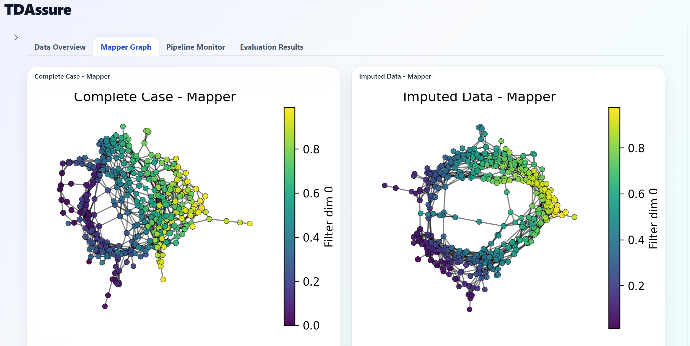

  

# TDAssure

### Assuring Reliable Missing Data Imputation Through the Shape of Your Data

A Shiny for Python dashboard for evaluating missing data imputation quality using Topological Data Analysis (TDA).

This repository provides the standalone dashboard implementation of the broader TDA-based imputation evaluation framework.

---

## Features

- Upload complete-case and imputed datasets
- Mapper graph visualization
- TDA-based topology comparison
- Whole pipeline execution
- Real-time monitoring dashboard
- p-value distribution analysis
- Significance summary statistics

---

## Quick Start

### 1. Download the project

Click:

`Code → Download ZIP`

Extract the folder to your computer.

---

### 2. Launch the app

Double click:

`Start_App.bat`

The app will:

- create a virtual environment automatically
- install dependencies automatically
- launch the local dashboard
- open the browser automatically

Notes: GUDHI installation may require additional build tools on some systems.

---

## Required Input Files

### Complete Case Dataset

- Currently supported input format: CSV
- May contain mixed variable types

### Imputed Dataset

- Currently supported input format: CSV
- Should have the same feature structure as the complete-case dataset

---

## Main Technologies

- Python Shiny
- GUDHI
- scikit-learn
- NetworkX
- Joblib
- Topological Data Analysis (TDA)

---

## Developer

Dr Yiyang Ge  
King's College London

---

## Supervision

Dr Raquel Iniesta  
King's College London

---

## Computational Notes

This pipeline can be computationally intensive, particularly when using:

- large datasets
- high-resolution Mapper settings
- multiple gain parameters
- large numbers of permutations

Runtime performance depends heavily on CPU capability and the selected parameter configuration.

For initial testing, users are encouraged to begin with:

- small datasets
- low permutation counts
- limited parameter combinations

---

## Notes

This tool is intended for research and methodological evaluation purposes.
